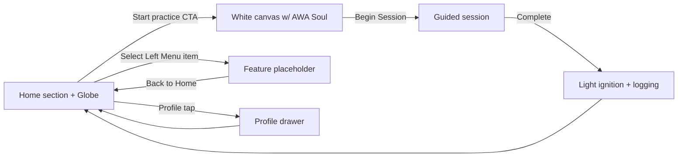

# Home v1 Experience Map

The refreshed home implementation anchors three columns: left navigation rail, center experience canvas, and right profile drawer. This document captures the states that now exist inside `prototype/lib/screens/home_screen.dart` so videcoding sessions can follow a consistent playbook.

## Layout System
- **Left rail (`LeftMenu`)**: hosts streak summary, mission counter, and navigation buttons referencing the destinations outlined in `/awa-docs/docs/features/layout-menu.md` and `/awa-docs/docs/features/profile-view.md`. Each tap updates `_activeSection` so the center canvas swaps content without leaving the screen.
- **Center canvas**: renders either the [Globe](/awa-docs/docs/features/globe.md) or the white `AWA Soul` canvas from `/awa-docs/docs/features/awa-soul.md` depending on `PracticeFlowState`. When non-home sections are selected, a placeholder view describes the future module.
- **Right drawer (`ProfilePanel`)**: unchanged interaction from v0 – tapping the profile orb opens the panel with user info, settings, and debug controls.

## State Diagram

## Implementation Notes
1. `HomeSection` enum (in `lib/home/models/home_section.dart`) defines nav items. `LeftMenu` consumes mock streak + mission data for now but uses real practice completion state to drive the “Light ignited” badge.
2. `_buildExperienceSurface` animates between globe and canvas with `AnimatedSwitcher`; the soul canvas draws scripted guidance pulled from `_practiceScript` so the prototype visually communicates the assistant flow even without audio.
3. The practice CTA is disabled whenever a non-home section is active to prevent conflicting transitions. Start button sets `PracticeFlowState.practiceSelect`, the canvas “Begin session” button moves to `practicing`, and “Complete practice” calls `PracticeService.markPracticeCompleted()` before returning to the globe.
4. Section placeholders occupy the center canvas for streaks/missions/history/saved/support; update these areas as their dedicated screens come online without refactoring the shell.
5. The product review area lives entirely under `prototype/` – no other workspace files were touched.

## QA Checklist Before Recording
- Confirm each `HomeSection` tab changes the center canvas copy and icon.
- Verify the globe renders, practice CTA is tappable, and the transition to the white canvas animates smoothly.
- Walk through the entire practice loop (Start → Begin session → Complete practice) and ensure the snackbar still appears after completion.
- Open and dismiss the profile drawer; interactions on left rail should be blocked while it is visible.
- Run `flutter analyze` and `flutter test` from the `prototype` directory to catch regressions quickly before running `flutter run`.
- Toggle the hamburger navigation while switching sections—menu should close after selection and the icon should morph between menu/close states.
- Use the debug Premium switch inside the profile drawer to confirm paid-only menu items unlock and badges update.

## Follow-ups
1. Replace mocked streak/mission data with real services once available.
2. Flesh out streaks and missions placeholder screens using the requirements captured in `/awa-docs/docs/features/daily-streak-reminder-v0-5.md` and `/awa-docs/docs/features/awaway-first-portal-v0-5.md`.
3. Extend `_practiceScript` into a dedicated data object per practice type so the assistant copy can localize via `LanguageService`.
